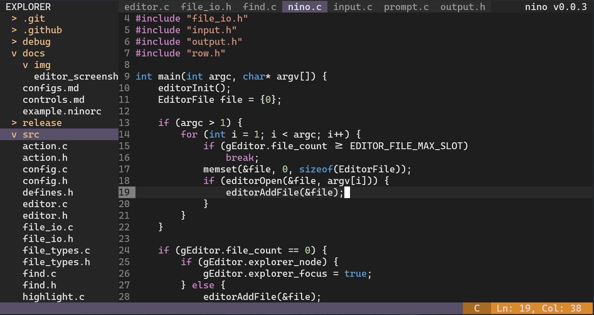

# nino

[](https://github.com/evanlin96069/nino/actions?query=branch%3Amaster)



A small terminal-based text editor written in C.

Inspired by [kilo](https://github.com/antirez/kilo)
and [snaptoken's Build Your Own Text Editor tutorial](https://viewsourcecode.org/snaptoken/kilo/).

## Why?
I'm not used to [Vim](https://www.vim.org/) and I don't like [nano](https://nano-editor.org/) either, so I make my own text editor. (I don't know about [micro](https://micro-editor.github.io/) back then...)

## Features
- Basic syntax highlight
- Basic UTF-8 support
- Multiple editor tabs
- Automatic indentation and bracket completion
- Mouse support
- Cut, copy, and paste the selected section
- Multiple undo/redo
- Search with smart case sensitivity
- File explorer

## Build
```bash
git clone https://github.com/evanlin96069/nino.git
cd nino
make
```
Then install the example config:
```bash
cp docs/example.ninorc ~/.ninorc
```

## Documentation
- [Configurations](docs/configs.md)
- [Controls](docs/controls.md)
- [Syntax Highlighting](docs/syntax.md)
