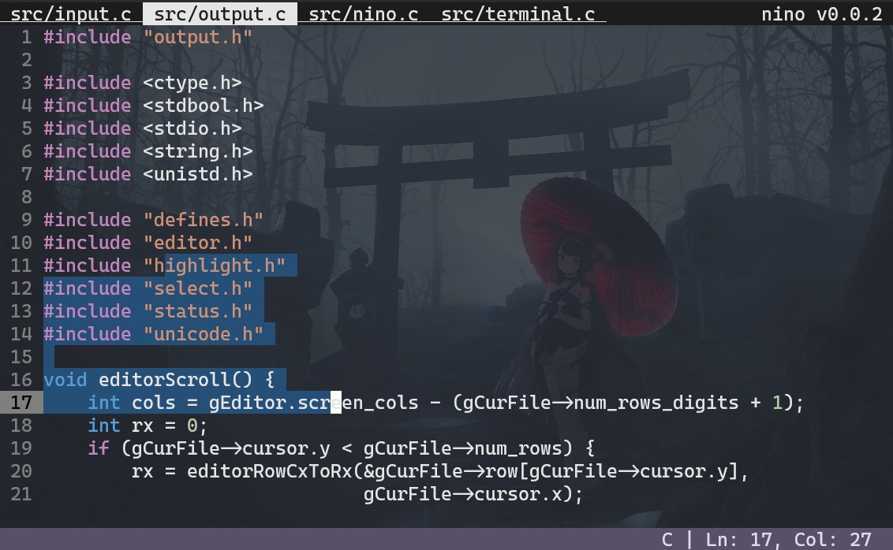

# nino



A small terminal-based text editor written in C.

Inspired by [kilo](https://github.com/antirez/kilo)
and [snaptoken's Build Your Own Text Editor tutorial](https://viewsourcecode.org/snaptoken/kilo/).


## Why?
I'm not used to vim and I don't like nano either, so I make my own text editor.


## Features
- Basic syntax highlight
- Basic UTF-8 support
- Multiple editor tabs
- Automatic indentation and bracket completion
- Mouse support
- Cut, copy, and paste selected section
- Multiple undo/redo
- Search with smart case sensitivity

## Installation
Nino requires a sufficiently Unix-like C library and a C99 compiler.

Build nino:
```
git clone https://github.com/evanlin96069/nino.git
cd nino
sudo make install
```
Install the [example](docs/example.ninorc) config:
```
cp docs/example.ninorc ~/.ninorc
```


## Documentation
- [Configs](docs/configs.md)
- [Controls](docs/controls.md)
